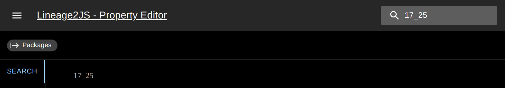

# A cross-platform Lineage2 Property Editor (WIP)

## What is this?

This project attempts to re-implement `Lineage2 Property Editor` in `electron` environment. This tool is a side project that I created to help with my port of [Lineage2 client to TypeScript](https://github.com/realratchet/Lineage2JS). It is not yet fully complete and I don't expect to do much work on it outside of my own needs for the other project.

## Why this?

In my attempt to port [Lineage2 client to Typescript](https://github.com/realratchet/Lineage2JS) I developed a need for a way to disable/modify certain object properties to make dissasembly less annoying. While there is an existing `L2Pe` project which people who are familiar with modding `Lineage2` client are familliar with. It's a bit broken on modern systems and just outright refuses to work on `*nix` based systems which I am using myself. Therefore, I found it easier just to dedicate some time to port the project to `electron` instead of dealing with no longer maintained `L2pe` project.

## Functionality

### Package browser

The user interface contains a package browser that lists packages by extension, at the moment only `UNR` packages are shown within the package list as there's little point for my use-case to have others, considering only other package that has properties is `U` package. This may or may not change in the future, depending on my own needs.

### Object browser

Similarly to package browser, within each of the packages you can find an object browser. It lists all objects within the package and groups them based on the type.

### Property browser

Similarly to the object browser, within each of the object you can find an object browser. It lists all properties that are available for the selected object grouped based on `Unreal Editor` group name. In addition to property names, you can inspect and modify property values. Objects within objects additionally allow you to step into them. 

`Note:` at the moment, native object properties are are not assigned names to (with exception to `Vector`, `Rotator` and `Color`) are not exposed to the editor. This is subject to change in the future as I find necessary for the editor. Instead, the natively serialized properties will get saved un-edited at the end of named properties as per specification.

## Struct property browser

Complex object properties like structs can also be stepped into and edited accordingly.

### Search

Fully functional search that can search for either `packages`, `objects` or `properties` based on the context that you are currently in. The search will attempt to find similar attributes when exact match is not known.

### Traversal history

When wanted changes are made you can step back to previous screen by using traversal history breadcrumbs.

## Dependencies

### Primary depenency

Because this is a sister project to my [Lineage2 client to TypeScript](https://github.com/realratchet/Lineage2JS) project, I have created a library [@l2js/core](https://github.com/realratchet/l2js-core) that can load the required packages and read object named and native properties.

### Additional dependencies
This is an `electron` based project that uses `react` and `Material UI` for the interface. Potentially `electron` dependency could be gotten rid off as `HTML5` now supports exposing directories to the frontend so the entire project can be delivered as single page application.

## TODO list

The implementation is not complete:

- [ ] Select path to `Lineage2` directory
- [x] Display package list
- [x] Display object list within package
- [x] Display property list within package
- [x] Array type support
- [x] Traversal history implementation
- [x] Search functionality
- [ ] Support for all property types
    - [x] Byte
    - [x] Enumeration
    - [x] Boolean
    - [x] ASCII string
    - [ ] UTF-16 string
    - [x] Integer
    - [x] Float
    - [x] Object
    - [ ] Class
    - [x] Struct
    - [ ] List types
- [ ] Persistent changes to properties
- [ ] Ability to save changes to disk
- [ ] Improve property editor UI to be more uniform (`low priority`)
- [ ] Installation/startup guide (`low priority`)